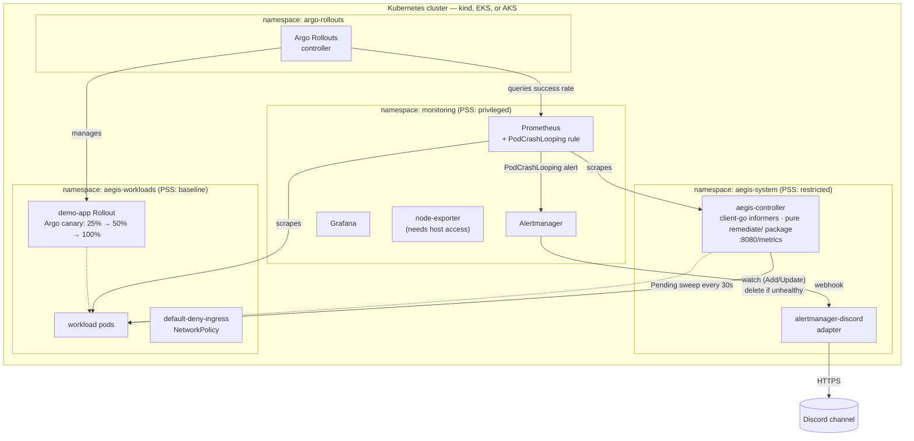

# Aegis — Self-Healing Kubernetes Platform

Aegis is a self-healing platform for Kubernetes. A Go controller watches
workload pods in real time and automatically remediates two common failure
modes — pods stuck in `CrashLoopBackOff` and pods stuck `Pending` past a
timeout — by deleting them so the scheduler tries again. It's backed by
Prometheus and Alertmanager for observability and alerting (with alerts
routed to Discord), Argo Rollouts for safe canary deployments, and
namespace-level Pod Security Standards and NetworkPolicy for defense in
depth.

Every manifest here is plain Kubernetes + Helm, so the same setup runs
unmodified on a local [kind](https://kind.sigs.k8s.io/) cluster, Amazon EKS,
or Azure AKS. kind is the fastest way to try it out with no cloud account
or cost; see [Running on a managed cluster](#running-on-a-managed-cluster-eks--aks)
for the two small changes needed to point the same manifests at a real
cluster.

## Architecture



- **`aegis-controller`** (`controller/`) — watches `aegis-workloads` through a
  `SharedInformerFactory` (event-driven, not polling) and deletes any pod
  that's crash-looping (`RestartCount > 5` with reason `CrashLoopBackOff`).
  A separate ticker goroutine sweeps for pods stuck `Pending` for more than 5
  minutes every 30s, since informers only fire on state changes and an idle
  Pending pod never produces one. The decision logic is pure and unit-tested
  (`controller/pkg/remediate`), separate from the Kubernetes client
  (`controller/pkg/k8sclient`) and Prometheus metrics
  (`controller/pkg/metrics`, exposed on `:8080/metrics`). The pod itself runs
  as non-root with all capabilities dropped, satisfying the `restricted` Pod
  Security Standard enforced on `aegis-system`.
- **`monitoring`** — `kube-prometheus-stack` (Prometheus, Alertmanager,
  Grafana, node-exporter, kube-state-metrics), plus a custom `PrometheusRule`
  that fires `PodCrashLooping` when a pod's restart count exceeds 5 for 2
  minutes. It lives in its own namespace, separate from `aegis-system`,
  because `node-exporter` legitimately needs host-level access (`hostNetwork`,
  `hostPID`, `hostPath`) to read node metrics — access that both `restricted`
  and `baseline` Pod Security Standards correctly block. This keeps
  `aegis-system` tightly scoped to just the hardened controller.
- **`alertmanager-discord`** — a small adapter (`aegis-system`) that
  Alertmanager's `PodCrashLooping` route calls via webhook, which forwards
  the alert into a Discord channel. Everything else stays on Alertmanager's
  `null` receiver to avoid noise from cluster-specific false positives (e.g.
  single-node etcd/kube-proxy checks on kind).
- **`argo-rollouts`** — the Argo Rollouts controller, enabling canary
  deployments (`manifests/rollouts/canary-app.yaml`) gated by a Prometheus
  success-rate `AnalysisTemplate`.
- **NetworkPolicy** — `aegis-workloads` has a default-deny-ingress policy.
  Like any Kubernetes NetworkPolicy, it's only *enforced* by a CNI that
  implements it — see [NetworkPolicy enforcement](#networkpolicy-enforcement)
  below for how to turn that on for kind, EKS, or AKS.
- **CI/CD** — `.github/workflows/build.yaml` builds and pushes the controller
  image to `ghcr.io/viditpawar/aegis-self-healing-k8s-controller` on every
  push to `controller/**`, using the repo's built-in `GITHUB_TOKEN` — no
  cloud credentials needed.

## Prerequisites

- Docker Desktop (running) — only needed for the local kind path
- `kubectl`, `helm`, `go`, `gh`
- `kind` (local path) **or** `eksctl`/AWS CLI (EKS) **or** Azure CLI (AKS)

## Running locally (kind)

```powershell
# 1. Create the cluster
kind create cluster --config kind\cluster-config.yaml

# 2. Namespaces + Pod Security Standards
kubectl apply -f manifests\namespaces.yaml

# 3. Monitoring stack
helm repo add prometheus-community https://prometheus-community.github.io/helm-charts
helm repo update
helm install monitoring prometheus-community/kube-prometheus-stack `
  --namespace monitoring `
  --set grafana.enabled=true `
  --set prometheus.prometheusSpec.retention=6h
kubectl apply -f manifests\prometheus-rules.yaml

# 4. Build and load the controller image
docker build -t aegis-controller:latest .\controller
kind load docker-image aegis-controller:latest --name aegis

# 5. Deploy the controller
kubectl apply -f manifests\controller\rbac.yaml
kubectl apply -f manifests\controller\deployment.yaml

# 6. (Optional) Discord alerting — create a webhook URL from a Discord
#    channel's Integrations settings first, then:
kubectl create secret generic discord-webhook -n aegis-system `
  --from-literal=DISCORD_WEBHOOK_URL=<your-webhook-url>
kubectl apply -f manifests\monitoring\alertmanager-discord.yaml
helm upgrade monitoring prometheus-community/kube-prometheus-stack `
  --namespace monitoring `
  --set grafana.enabled=true `
  --set prometheus.prometheusSpec.retention=6h `
  -f manifests\monitoring\alertmanager-values.yaml

# 7. Argo Rollouts
kubectl create namespace argo-rollouts
kubectl apply -n argo-rollouts -f https://github.com/argoproj/argo-rollouts/releases/latest/download/install.yaml
kubectl apply -f manifests\rollouts\canary-app.yaml
kubectl apply -f manifests\rollouts\analysis-template.yaml

# 8. NetworkPolicy
kubectl apply -f manifests\networkpolicy\default-deny.yaml
```

## Running on a managed cluster (EKS / AKS)

Steps 2, 3, 6, 7, and 8 above are identical on any cluster. Only two things
change:

1. **Cluster creation** replaces step 1 (kind-specific).
2. **The controller image** — instead of building locally and side-loading
   with `kind load docker-image`, point `manifests/controller/deployment.yaml`
   at the image the CI workflow already publishes:
   `ghcr.io/viditpawar/aegis-self-healing-k8s-controller:latest`, with
   `imagePullPolicy: Always`. It's a public package on a public repo, so no
   pull secret is needed.

### EKS

```bash
eksctl create cluster --name aegis --region us-east-1 --nodes 3
# ... apply steps 2, 3, 6, 7, 8 as above ...

# Teardown
eksctl delete cluster --name aegis
```

### AKS

```bash
az group create --name aegis-rg --location eastus
az aks create --resource-group aegis-rg --name aegis --node-count 3 \
  --network-policy calico --generate-ssh-keys
az aks get-credentials --resource-group aegis-rg --name aegis
# ... apply steps 2, 3, 6, 7, 8 as above ...

# Teardown
az group delete --name aegis-rg --yes --no-wait
```

`--network-policy calico` is what makes the `default-deny-ingress` policy
actually enforced on AKS — see below.

## NetworkPolicy enforcement

A `NetworkPolicy` object is only enforced by a CNI that implements it — this
is true on every distribution, not just kind:

- **kind**: the default CNI (`kindnet`) doesn't enforce NetworkPolicy. Install
  [Calico](https://kind.sigs.k8s.io/docs/user/calico/) (`disableDefaultCNI: true`
  in the cluster config) if you want local enforcement.
- **EKS**: the default VPC CNI doesn't enforce it out of the box either;
  enable the VPC CNI's built-in network policy support (`aws eks
  update-addon --addon-name vpc-cni --configuration-values
  '{"enableNetworkPolicy":"true"}'`) or install Calico.
- **AKS**: pass `--network-policy calico` (or `azure`) at cluster creation, as
  shown above — this is the one case where it's a single flag.

## Verifying self-healing

```powershell
kubectl run crash-test --image=busybox -n aegis-workloads --restart=Always -- sh -c "exit 1"
kubectl logs -n aegis-system -l app=aegis-controller -f
```

Once the pod's restart count passes 5, the controller log will show it
deleting the pod to force a reschedule, and (if Discord alerting is
configured) a `PodCrashLooping` message will land in your channel within a
couple of minutes.

## Repo layout

```
controller/
  cmd/main.go            wiring only: build client, run informer, call remediate
  pkg/remediate/          pure decision functions + table-driven tests
  pkg/k8sclient/          in-cluster clientset construction
  pkg/metrics/             Prometheus counters, /metrics endpoint
manifests/
  namespaces.yaml          aegis-system / aegis-workloads / monitoring
  prometheus-rules.yaml    PodCrashLooping alert rule
  controller/              RBAC, Deployment, metrics Service
  monitoring/              alertmanager-discord adapter + Helm values
  rollouts/                Argo Rollouts canary + AnalysisTemplate
  networkpolicy/           default-deny-ingress
kind/cluster-config.yaml   local 3-node kind cluster
.github/workflows/         CI: build + push controller image to GHCR
```

## Teardown (kind)

```powershell
kind delete cluster --name aegis
```
