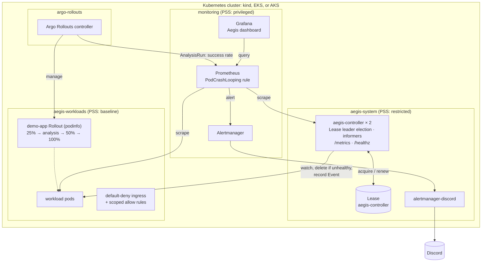

# Aegis

[](https://github.com/viditpawar/aegis-self-healing-k8s/actions/workflows/build.yaml)


A self-healing platform for Kubernetes. A Go controller watches workload pods and
**remediates the two failures that most often need a human at 3 a.m.**: pods stuck in
`CrashLoopBackOff` and pods stuck `Pending`. It deletes them so the scheduler starts them
again, records a Kubernetes Event explaining why, and exposes every action as a Prometheus
metric. It runs as two replicas with Lease-based leader election, so remediation keeps
working through a node or pod failure without two controllers acting at once.

Around the controller sits the platform it needs to be trusted in production:
Prometheus and Alertmanager with alerts routed to Discord, a Grafana dashboard for
remediation activity, Argo Rollouts canary deployments gated on live success-rate
metrics, and Pod Security Standards plus NetworkPolicy per namespace. Everything is plain
Kubernetes and Helm, so the same manifests run on a local [kind](https://kind.sigs.k8s.io/)
cluster, Amazon EKS, or Azure AKS. Locally it costs nothing and comes up with one command.

## Contents

- [Architecture](#architecture)
- [Features](#features)
- [Design notes](#design-notes)
- [Tech stack](#tech-stack)
- [Project structure](#project-structure)
- [Quick start](#quick-start)
- [Configuration](#configuration)
- [How to demo this](#how-to-demo-this)
- [Observability](#observability)
- [Security](#security)
- [Running on EKS or AKS](#running-on-eks-or-aks)
- [CI/CD](#cicd)
- [Roadmap](#roadmap)

## Architecture


```mermaid
flowchart TB
    subgraph cluster["Kubernetes cluster: kind, EKS, or AKS"]
        subgraph ns_system["aegis-system  (PSS: restricted)"]
            controller["aegis-controller × 2<br/>Lease leader election · informers<br/>/metrics · /healthz"]
            lease[("Lease<br/>aegis-controller")]
            discordAdapter["alertmanager-discord"]
        end

        subgraph ns_workloads["aegis-workloads  (PSS: baseline)"]
            rollout["demo-app Rollout (podinfo)<br/>25% → analysis → 50% → 100%"]
            pods["workload pods"]
            netpol["default-deny ingress<br/>+ scoped allow rules"]
        end

        subgraph ns_monitoring["monitoring  (PSS: privileged)"]
            prometheus["Prometheus<br/>PodCrashLooping rule"]
            alertmanager["Alertmanager"]
            grafana["Grafana<br/>Aegis dashboard"]
        end

        subgraph ns_rollouts["argo-rollouts"]
            rolloutsCtrl["Argo Rollouts controller"]
        end
    end

    discord[("Discord")]

    controller <-- "acquire / renew" --> lease
    controller -- "watch, delete if unhealthy,<br/>record Event" --> pods
    prometheus -- "scrape" --> controller
    prometheus -- "scrape" --> pods
    prometheus -- "alert" --> alertmanager --> discordAdapter --> discord
    grafana -- "query" --> prometheus
    rolloutsCtrl -- "manage" --> rollout -.-> pods
    rolloutsCtrl -- "AnalysisRun: success rate" --> prometheus
```

How the controller works:

1. **Elect a leader.** Both replicas compete for the `aegis-controller` Lease in
   `aegis-system`. The standby only serves `/metrics` and `/healthz` until it wins the Lease.
2. **Watch, don't poll.** The leader runs a `SharedInformerFactory` on `aegis-workloads` and
   evaluates every pod Add and Update event as it happens.
3. **Decide with pure functions.** `remediate.Policy` decides from pod status alone: a
   container in `CrashLoopBackOff` with more than 5 restarts, or a pod `Pending` for more
   than 5 minutes. Both thresholds are configurable.
4. **Sweep what informers can't see.** A pod sitting idle in `Pending` never produces an
   event, so a 30-second ticker lists the namespace and catches those.
5. **Act once, and not too often.** Deletes are deduplicated by pod UID, so a resync racing
   a real update can't delete or count the same pod twice. A rate limit (10 per minute by
   default) stops a bad release from turning into a wave of deletions, and pods annotated
   `aegis/remediate: "false"` are never touched.
6. **Leave a trail.** Each deletion increments a Prometheus counter and records a `Warning`
   Event on the pod with the reason.
7. **Fail safe.** On SIGTERM the leader stops, releases the Lease and the standby takes over
   in about 2 seconds. A replica that loses the Lease unexpectedly exits and restarts
   instead of risking a second active leader.

## Features

- Event-driven remediation of `CrashLoopBackOff` and stuck-`Pending` pods using client-go informers
- Highly available: 2 replicas, Lease-based leader election, ~2s failover on graceful shutdown, about 15s after a crash
- Exactly-once remediation per pod, enforced by UID deduplication and verified on a live cluster
- Guardrails: a deletion rate limit, and an `aegis/remediate: "false"` opt-out annotation for pods you're debugging
- Kubernetes Events (`CrashLoopRemediated`, `PendingRemediated`) so `kubectl get events` explains every deletion
- Thresholds and target namespace configured by environment variables, validated at startup
- Prometheus metrics, `/healthz` liveness and readiness probes, graceful shutdown on SIGTERM
- Grafana dashboard for remediations, remediation rate, and active-leader count
- Alerts for crash-looping pods and for the controller itself (down, no leader, split brain, remediation spike), routed to Discord and unit tested with `promtool`
- Argo Rollouts canary that measures **only the canary's pods** and is promoted only if their success rate stays ≥ 95%. Verified: a release returning ~20% errors was aborted
- Pod Security Standards per namespace (`restricted` for the controller) and default-deny NetworkPolicy
- Hardened image: multi-stage build, distroless, non-root, all capabilities dropped
- One-command local setup that is safe to re-run, with pinned chart and Argo Rollouts versions
- Unit tests for every package, including the controller against a fake clientset and leader failover
- CI validates every manifest against its schema (including Argo and Prometheus Operator CRDs) and unit tests the alert rules

## Design notes

Most of the design came from problems that only showed up on a real cluster.

| Problem | How Aegis handles it |
|---|---|
| Informers only fire on state changes, so a pod idle in `Pending` is never seen again | A separate 30-second sweep lists the namespace and applies the Pending policy |
| An informer resync racing a real update delivered the same crash-looping pod twice, double-counting `aegis_crashloop_deletions_total` | Deletes are deduplicated by pod UID for 2 minutes, with expired entries pruned on each call |
| Two replicas would both delete the same pod | Lease-based leader election; only the leader runs informers. Verified: leader counted 1 deletion, standby 0 |
| A replica that loses its Lease mid-run could keep acting on a stale informer | Losing leadership ends the process, so the pod restarts cleanly as a standby |
| client-go starts `OnStartedLeading` in a goroutine it never waits for, so its result can't be read safely | The callback only hands over the leadership context. The controller runs on the caller's goroutine, where errors are collected and the Lease is released on failure |
| A typo in a threshold (`five`, `300` without a unit) would silently fall back to a default | Configuration is validated at startup and the controller refuses to start |
| kindnet in kind v0.32.0 **enforces** NetworkPolicy, so default-deny silently dropped Prometheus scrapes and canary traffic | An explicit allow rule for `monitoring` → `demo-app`. See [Security](#security) |
| Argo Rollouts' Prometheus provider returns `[]float64`, so `result >= 0.95` never matched | `successCondition: result[0] >= 0.95` |
| The canary analysis measured every `http_requests_total` in the cluster, so healthy stable pods diluted the canary's errors. A release returning ~20% errors scored **95.65%** and would have been promoted | The Rollout passes the canary's pod-template-hash into the `AnalysisTemplate`, and the query matches only `demo-app-<hash>-*` pods. The same release scored **80.43%** and was aborted |
| `PodCrashLooping` used the lifetime restart count (`> 5`), which never resets. After a few cluster restarts it was firing for **29 healthy pods**, all routed to Discord | It now fires on `increase(...[15m]) > 3`, i.e. restarting *now*. A `promtool` test pins the case of a pod with 18 old restarts |
| A bad release can crash-loop dozens of pods at once, and deleting them all helps nothing | Deletions are rate limited, throttled pods are retried later, and `AegisRemediationSpike` alerts a human |
| node-exporter needs `hostNetwork`, `hostPID` and `hostPath`, which `restricted` and `baseline` block | Monitoring lives in its own `privileged` namespace, keeping `aegis-system` at `restricted` |
| kube-prometheus-stack alerts that are false positives on kind (single-node etcd, kube-proxy) flooded Discord | Alertmanager routes only `PodCrashLooping` to Discord; everything else goes to a `null` receiver |
| Two replicas exporting counters doubled every dashboard series | Dashboard queries use `sum()`, and an "Active Leader" panel shows `sum(aegis_leader)`: 1 healthy, 0 no leader, 2 split brain |
| Re-running setup without the Discord URL would remove Discord routing from the Helm release | `up.ps1` keeps Discord enabled when the `discord-webhook` Secret already exists |
| The local image is always `:latest`, so applying an unchanged Deployment doesn't pick up a new build | `up.ps1` runs `kubectl rollout restart` after loading the image |

## Tech stack

- **Controller:** Go 1.26, client-go (informers, leader election, event recorder), prometheus/client_golang
- **Kubernetes:** kind v0.32.0 locally, EKS or AKS in the cloud, Pod Security Standards, NetworkPolicy, RBAC
- **Observability:** kube-prometheus-stack 88.3.0 (Prometheus Operator, Alertmanager, Grafana), ServiceMonitors, PrometheusRule
- **Progressive delivery:** Argo Rollouts v1.9.1 with a Prometheus `AnalysisTemplate`, [podinfo](https://github.com/stefanprodan/podinfo) as the demo app
- **Alerting:** Alertmanager → [alertmanager-discord](https://github.com/benjojo/alertmanager-discord) → Discord
- **Packaging:** multi-stage Docker build on distroless `static-debian12:nonroot`
- **CI/CD:** GitHub Actions, GitHub Container Registry
- **Tooling:** PowerShell setup scripts, Helm

## Project structure

```text
aegis-self-healing-k8s/
├── controller/
│   ├── cmd/main.go                 # wiring: config, clients, event recorder, signals
│   ├── pkg/
│   │   ├── config/                 # AEGIS_* environment variables, validated at startup
│   │   ├── controller/             # informer, Pending sweep, UID dedup, Events
│   │   ├── leader/                 # Lease-based leader election
│   │   ├── remediate/              # pure decision logic (Policy)
│   │   ├── metrics/                # Prometheus metrics, /metrics and /healthz
│   │   └── k8sclient/              # in-cluster clientset
│   └── Dockerfile                  # multi-stage, distroless, non-root
├── manifests/
│   ├── namespaces.yaml             # namespaces + Pod Security Standards labels
│   ├── prometheus-rules.yaml       # PodCrashLooping alert
│   ├── controller/                 # RBAC (incl. Lease Role), Deployment, Service, ServiceMonitor
│   ├── monitoring/                 # Discord adapter, Alertmanager values, Grafana dashboard
│   ├── rollouts/                   # demo-app Rollout, AnalysisTemplate, ServiceMonitor
│   └── networkpolicy/              # default-deny ingress + scoped allow rule
├── tests/prometheus/               # promtool unit tests for the alert rules
├── kind/cluster-config.yaml        # 1 control plane + 2 workers
├── scripts/
│   ├── up.ps1                      # one-command local setup, safe to re-run
│   ├── down.ps1                    # delete the local cluster
│   └── demo/bad-release.patch.yaml # a release that fails ~1/3 of requests, for the canary demo
└── .github/workflows/build.yaml    # Go checks, manifest validation, rule tests, image publish
```

## Quick start

### Prerequisites

- Docker Desktop, running
- `kind`, `kubectl`, `helm`
- Go 1.26 (only to run the tests locally)

### One command

```powershell
git clone https://github.com/viditpawar/aegis-self-healing-k8s
cd aegis-self-healing-k8s
.\scripts\up.ps1                                   # full stack, without Discord
.\scripts\up.ps1 -DiscordWebhookUrl <webhook-url>  # full stack, with Discord alerts
```

The script creates a 3-node kind cluster named `aegis` (or reuses one that exists),
installs the monitoring stack, builds and loads the controller image, deploys the
controller, Argo Rollouts, the demo app and the NetworkPolicies, and waits for each to be
ready. Every command targets the `kind-aegis` context, so your current kubectl context is
left alone.

| Service | How to reach it |
|---|---|
| Grafana | `kubectl --context kind-aegis port-forward -n monitoring svc/monitoring-grafana 3000:80`, then http://localhost:3000 |
| Prometheus | `kubectl --context kind-aegis port-forward -n monitoring svc/monitoring-kube-prometheus-prometheus 9090`, then http://localhost:9090 |
| Controller logs | `kubectl --context kind-aegis logs -n aegis-system deploy/aegis-controller` |

Grafana's admin password:
`kubectl --context kind-aegis get secret -n monitoring monitoring-grafana -o jsonpath="{.data.admin-password}"`
(base64-encoded).

To remove everything: `.\scripts\down.ps1`.

<details>
<summary><b>Manual setup, step by step</b></summary>

```powershell
# 1. Cluster
kind create cluster --config kind\cluster-config.yaml

# 2. Namespaces + Pod Security Standards
kubectl apply -f manifests\namespaces.yaml

# 3. Monitoring stack
helm repo add prometheus-community https://prometheus-community.github.io/helm-charts
helm repo update
helm install monitoring prometheus-community/kube-prometheus-stack `
  --namespace monitoring --version 88.3.0 `
  --set grafana.enabled=true `
  --set prometheus.prometheusSpec.retention=6h
kubectl apply -f manifests\prometheus-rules.yaml
kubectl apply -f manifests\monitoring\grafana-dashboard.yaml

# 4. Controller image
docker build -t aegis-controller:latest .\controller
kind load docker-image aegis-controller:latest --name aegis

# 5. Controller
kubectl apply -f manifests\controller\rbac.yaml
kubectl apply -f manifests\controller\deployment.yaml
kubectl apply -f manifests\controller\servicemonitor.yaml

# 6. Discord alerting (optional). Create a webhook in your Discord channel's
#    Integrations settings first.
kubectl create secret generic discord-webhook -n aegis-system `
  --from-literal=DISCORD_WEBHOOK_URL=<your-webhook-url>
kubectl apply -f manifests\monitoring\alertmanager-discord.yaml
helm upgrade monitoring prometheus-community/kube-prometheus-stack `
  --namespace monitoring --version 88.3.0 `
  --set grafana.enabled=true `
  --set prometheus.prometheusSpec.retention=6h `
  -f manifests\monitoring\alertmanager-values.yaml

# 7. Argo Rollouts + demo app
kubectl create namespace argo-rollouts
kubectl apply -n argo-rollouts -f https://github.com/argoproj/argo-rollouts/releases/download/v1.9.1/install.yaml
kubectl apply -f manifests\rollouts\canary-app.yaml
kubectl apply -f manifests\rollouts\analysis-template.yaml
kubectl apply -f manifests\rollouts\demo-app-servicemonitor.yaml

# 8. NetworkPolicy
kubectl apply -f manifests\networkpolicy\default-deny.yaml
kubectl apply -f manifests\networkpolicy\allow-demo-app.yaml
```

</details>

## Configuration

The controller is configured through environment variables, set in
[`manifests/controller/deployment.yaml`](manifests/controller/deployment.yaml). An invalid
value stops the controller at startup rather than falling back to a default.

| Variable | Default | Description |
|---|---|---|
| `AEGIS_NAMESPACE` | `aegis-workloads` | Namespace to watch and remediate |
| `AEGIS_MAX_RESTARTS` | `5` | Delete a `CrashLoopBackOff` pod once its restart count exceeds this |
| `AEGIS_PENDING_TIMEOUT` | `5m` | Delete a pod `Pending` for longer than this (Go duration, such as `90s` or `10m`) |
| `AEGIS_MAX_DELETIONS_PER_MINUTE` | `10` | Cap on deletions per minute. Throttled pods are retried on the next resync. `0` disables the cap |
| `AEGIS_LEADER_ELECTION` | `false` | Compete for a Lease so only one replica remediates. The manifest sets `true` |
| `POD_NAME`, `POD_NAMESPACE` | none | Required when leader election is on. Set from the downward API in the manifest |

To exempt a single pod, for example while debugging it by hand, annotate it:

```powershell
kubectl annotate pod <name> -n aegis-workloads aegis/remediate=false
```

The ClusterRole lets the controller work in any namespace you point it at, but that
namespace's Pod Security and NetworkPolicy setup is up to you.

## How to demo this

About 15 minutes on a running cluster. Switch to it first with
`kubectl config use-context kind-aegis`.

**1. Self-healing.** Start a pod that always crashes, then watch the controller:

```powershell
kubectl run crash-test --image=busybox -n aegis-workloads --restart=Always -- sh -c "exit 1"
kubectl logs -n aegis-system deploy/aegis-controller -f
```

Kubernetes backs off between restarts, so restart 6 arrives after about 7 minutes. Then:

```text
Pod crash-test: CrashLoopBackOff, restart count 6, deleting to force reschedule
```

```powershell
kubectl get events -n aegis-workloads --field-selector reason=CrashLoopRemediated
```

```text
LAST SEEN   TYPE      REASON                OBJECT           MESSAGE
12s         Warning   CrashLoopRemediated   pod/crash-test   Deleted by aegis-controller to force reschedule: CrashLoopBackOff, restart count 6
```

With Discord configured, a `PodCrashLooping` alert also arrives in the channel.

**2. Leader failover.** Find the leader, delete it, and check who holds the Lease now:

```powershell
kubectl get lease aegis-controller -n aegis-system -o jsonpath="{.spec.holderIdentity}"
kubectl delete pod -n aegis-system <leader-pod-name>
kubectl get lease aegis-controller -n aegis-system -o jsonpath="{.spec.holderIdentity}"
```

The standby takes over in about 2 seconds and logs `acquired leadership`. The Grafana
"Active Leader" panel stays at 1.

**3. Gated canary, good release.** Generate traffic so the analysis has data, then roll
out a new version:

```powershell
kubectl run traffic-gen --image=busybox -n aegis-workloads --restart=Always -- `
  sh -c "while true; do wget -q -O- http://demo-app:9898/ >/dev/null 2>&1; sleep 0.5; done"
kubectl argo rollouts set image demo-app -n aegis-workloads demo-app=stefanprodan/podinfo:6.7.0
kubectl get rollout demo-app -n aegis-workloads -w
```

(Without the `kubectl argo rollouts` plugin, edit the image in
`manifests/rollouts/canary-app.yaml` and re-apply it.) The rollout moves to 25%, then runs
an `AnalysisRun` that measures the success rate 5 times, 30 seconds apart. It continues to
50% and 100% only if every measurement is ≥ 0.95. Check it with
`kubectl get analysisrun -n aegis-workloads`.

**4. Gated canary, bad release.** podinfo can inject errors into about a third of its
responses. Roll out a version with that turned on:

```powershell
kubectl patch rollout demo-app -n aegis-workloads --type merge --patch-file scripts\demo\bad-release.patch.yaml
kubectl get rollout demo-app -n aegis-workloads -w
```

The first measurement fails and Argo aborts:

```text
RolloutAborted: Rollout aborted update to revision 13: Step-based analysis phase error/failed:
Metric "success-rate" assessed Failed due to failed (1) > failureLimit (0)
```

The canary is scaled to zero and all traffic stays on the stable version. Restore it with
`kubectl apply -f manifests\rollouts\canary-app.yaml`.

**5. Clean up:** `kubectl delete pod traffic-gen -n aegis-workloads`.

## Observability

### Metrics

Exposed by each controller replica on `:8080/metrics` and scraped through a ServiceMonitor.

| Metric | Type | What it answers |
|---|---|---|
| `aegis_crashloop_deletions_total` | counter | How many crash-looping pods were remediated |
| `aegis_pending_deletions_total` | counter | How many stuck-Pending pods were remediated |
| `aegis_remediations_throttled_total` | counter | How many remediations were postponed by the rate limit |
| `aegis_leader` | gauge | Whether this replica is the active leader (1) or on standby (0) |

### Kubernetes Events

| Reason | Type | Recorded when |
|---|---|---|
| `CrashLoopRemediated` | Warning | A pod was deleted for exceeding `AEGIS_MAX_RESTARTS` in `CrashLoopBackOff` |
| `PendingRemediated` | Warning | A pod was deleted for staying `Pending` past `AEGIS_PENDING_TIMEOUT` |
| `RemediationThrottled` | Warning | A remediation was postponed because `AEGIS_MAX_DELETIONS_PER_MINUTE` was reached |

### Dashboard

The **Aegis Controller** Grafana dashboard is provisioned automatically from a labeled
ConfigMap. It shows total crash-loop and Pending remediations, the remediation rate over
time, and the number of active leaders (1 is healthy, 0 means no replica is remediating,
2 means split brain).

### Alerts

Defined in [`manifests/prometheus-rules.yaml`](manifests/prometheus-rules.yaml), unit tested
in [`tests/prometheus/rules.test.yaml`](tests/prometheus/rules.test.yaml), and routed to
Discord. Every other kube-prometheus-stack alert goes to a `null` receiver.

| Alert | Severity | Fires when |
|---|---|---|
| `PodCrashLooping` | warning | A container restarted more than 3 times in 15 minutes, for 2 minutes |
| `AegisControllerDown` | critical | No controller replica can be scraped for 5 minutes |
| `AegisNoLeader` | critical | Replicas are up but none holds the Lease for 2 minutes |
| `AegisSplitBrain` | critical | More than one replica reports itself as leader for 1 minute |
| `AegisRemediationSpike` | warning | More than 5 pods remediated in 10 minutes |

Run the rule tests locally with Docker:

```powershell
python -c "import yaml; yaml.safe_dump(yaml.safe_load(open('manifests/prometheus-rules.yaml'))['spec'], open('tests/prometheus/rules.generated.yaml','w'))"
docker run --rm -v "${PWD}/tests/prometheus:/w" -w /w --entrypoint promtool prom/prometheus:v3.5.0 test rules rules.test.yaml
```

## Security

**Pod Security Standards** are enforced per namespace:

| Namespace | Level | Why |
|---|---|---|
| `aegis-system` | `restricted` | Only the hardened controller and Discord adapter run here |
| `aegis-workloads` | `baseline` | General application workloads |
| `monitoring` | `privileged` | node-exporter needs host networking, PID and filesystem access to read node metrics |

**The controller** runs as non-root on a distroless image, with privilege escalation off,
all Linux capabilities dropped, the `RuntimeDefault` seccomp profile, and a memory limit.
Its RBAC allows only reading and deleting pods, creating Events, and managing its own Lease
in `aegis-system`.

**NetworkPolicy:** `aegis-workloads` denies all ingress by default.
`allow-demo-app-ingress` allows traffic to the demo app from the same namespace and
Prometheus scrapes from `monitoring`. Any new workload there needs its own allow rule, or
its scrapes and traffic will time out silently.

A NetworkPolicy only has an effect if the cluster's network plugin (CNI) enforces it:

| Platform | Enforced by default? | What to do |
|---|---|---|
| kind v0.32.0+ | Yes, kindnet enforces it (confirmed while building this project) | Nothing. On older kind, install [Calico](https://kind.sigs.k8s.io/docs/user/calico/) |
| EKS | No | Enable it on the VPC CNI add-on (`enableNetworkPolicy: "true"`) or install Calico |
| AKS | No | Create the cluster with `--network-policy calico` or `azure` |

## Running on EKS or AKS

Steps 2, 3 and 5–8 of the [manual setup](#quick-start) are the same on any cluster. Two
things change:

1. **Cluster creation** replaces step 1.
2. **The controller image:** skip step 4, and set the image in
   `manifests/controller/deployment.yaml` to the one CI publishes,
   `ghcr.io/viditpawar/aegis-self-healing-k8s-controller:latest`, with
   `imagePullPolicy: Always`. It's public, so no pull secret is needed.

**EKS**

```bash
eksctl create cluster --name aegis --region us-east-1 --nodes 3
# apply steps 2, 3, 5–8
eksctl delete cluster --name aegis   # teardown
```

**AKS**

```bash
az group create --name aegis-rg --location eastus
az aks create --resource-group aegis-rg --name aegis --node-count 3 \
  --network-policy calico --generate-ssh-keys
az aks get-credentials --resource-group aegis-rg --name aegis
# apply steps 2, 3, 5–8
az group delete --name aegis-rg --yes --no-wait   # teardown
```

## CI/CD

[`.github/workflows/build.yaml`](.github/workflows/build.yaml) runs on every pull request
and every push to `main` that touches the controller, manifests, tests, scripts or the
workflow itself.

| Job | What it checks |
|---|---|
| `test` | `gofmt` (fails on any unformatted file), `go mod tidy` leaves no diff, `go vet`, and `go test -race` across all packages |
| `manifests` | kubeconform in strict mode on every manifest, with schemas for the Argo Rollouts and Prometheus Operator CRDs. `promtool check rules` and `promtool test rules` on the alert rules. The Grafana dashboard JSON parses, and both PowerShell scripts parse |
| `build` | Runs after `test` and `manifests`. On pull requests, builds the image to prove the Dockerfile works. On `main`, also pushes `ghcr.io/viditpawar/aegis-self-healing-k8s-controller` as `:latest` and `:sha-<commit>` |

Each job is granted only the permissions it needs: `test` and `manifests` get
`contents: read`, and only `build` also gets `packages: write`, and it uses the built-in `GITHUB_TOKEN`, so no cloud credentials are
stored in the repository.

To run the same checks locally:

```powershell
cd controller
gofmt -l .
go vet ./...
go test ./...
```

## Roadmap

**Done**

- [x] Informer-based controller for `CrashLoopBackOff` and stuck-`Pending` pods
- [x] Exactly-once remediation with UID deduplication
- [x] Kubernetes Events and Prometheus metrics for every remediation
- [x] Configurable thresholds and namespace, validated at startup
- [x] Two replicas with Lease-based leader election and tested failover
- [x] `/healthz` probes, resource limits, graceful shutdown
- [x] Prometheus, Alertmanager → Discord, Grafana dashboard
- [x] Argo Rollouts canary gated on live success rate
- [x] Pod Security Standards and default-deny NetworkPolicy
- [x] CI: formatting, tidy, vet, race tests, image publishing to GHCR
- [x] One-command local setup
- [x] Canary analysis scoped to the canary's own pods, with a verified abort of a bad release
- [x] Alerts on the controller itself, and `promtool` unit tests for every rule
- [x] Remediation guardrails: deletion rate limit and opt-out annotation
- [x] Manifest schema validation in CI

**Next**

- **End-to-end test in CI:** bring up kind in GitHub Actions, run the crash-loop and
  failover checks, and fail the build if remediation doesn't happen.
- **Helm chart** for the controller, so EKS and AKS installs are one command too.
- **Per-workload limits:** the rate limit is global today; a per-Deployment budget would
  stop one bad workload from using up the limit for everything else.
- **Image scanning** with Trivy and pinned action SHAs in CI.

## License

MIT. See [LICENSE](LICENSE).
